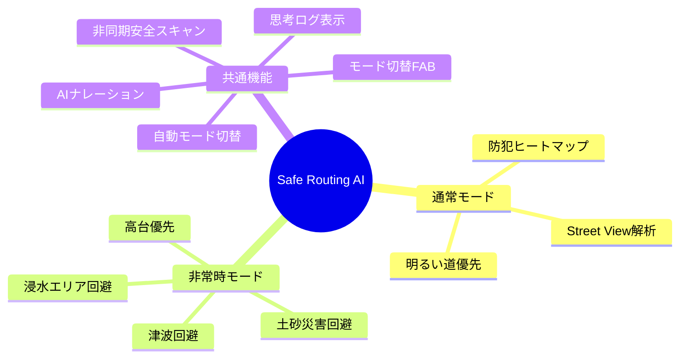
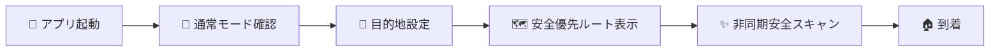
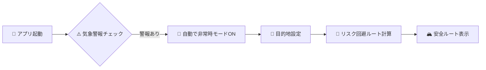

# 02_要件定義書.md

## 1. プロダクト要件 (Product Requirements)

### コンセプト
「いつもの移動は"安心寄り"に、非常時は"生存寄り"に切り替わるナビ」

### ターゲットユーザー
- **通常時**: 夜道や治安に不安を感じるライトユーザー（特に女性や子供連れ）。
- **非常時**: 突然の豪雨や災害に遭遇し、パニックになりかけている全ユーザー。
- **審査員**: 「AIが自律的に考え、人を助ける」というAgenticな未来を見たい技術者。

## 2. 機能要件 (Functional Requirements) - MVP

### 機能一覧図

### F-01: モード切替機能
- **日常モード (Normal Mode)**:
    - 青ベースの安心感あるUI。
    - 「治安（防犯ヒートマップ）」と「明るさ（Street View解析）」を優先したルート提示。
- **非常時モード (Emergency Mode)**:
    - 赤/黒ベースの警告色UI。
    - 「生存（浸水・土砂・津波回避）」を最優先したルート提示。
    - ワンタップで即座に切り替え可能であること。
- **自動モード切替**:
    - 気象警報（大雨・津波等）を検知した場合、自動的に非常時モードに切り替え。

### F-02: 状況適応型ルート探索
- **Normal**: Google Routes APIの最適ルートに加え、防犯スコアが高いルートを優先。
- **Emergency**: 気象警報の種類に応じて該当リスク（浸水/土砂/津波）のハザードマップと照合し、危険エリアを回避するルートを提示。
- **Autonomous Retry**: ルートが見つからない場合、AIが自律的に経由地を計算し、再検索を行う。

### F-03: AIナレーション & 思考ログ
- ユーザーに対して「なぜそのルートを選んだか」を説明するテキストを表示。
- AIのバックグラウンド処理（天気確認、画像解析、ルート選定）を「Thinking Process」として可視化する。

### F-04: 非同期安全性スキャン (Async Safety Scan)
- ルート表示後、バックグラウンドでルート上の地点のストリートビュー画像を解析。
- 解析完了次第、地図上に「安全性スコア」ピンをポップアップ表示する。

## 3. 非機能要件 (Non-Functional Requirements)

### NF-01: レスポンス速度
- モード切替からルート探索開始までのラグ: 0.5秒以内。
- 最初のルート候補表示: 3秒以内（画像解析を待たずに表示）。

### NF-02: 可用性・信頼性
- フォールバック処理を活用し、デモ展示中に「ルートが見つからない」「エラーになる」事態を回避する。

### NF-03: セキュリティ・倫理
- **免責事項**: 「このナビは参考情報です」という免責を必ず画面に表示する。
- **APIキー**: クライアントサイドにAPIキーを埋め込まない（Backend経由）。

## 4. ユーザー体験フロー (User Journey)

### 日常シナリオ

### 緊急シナリオ（自動切り替え）

