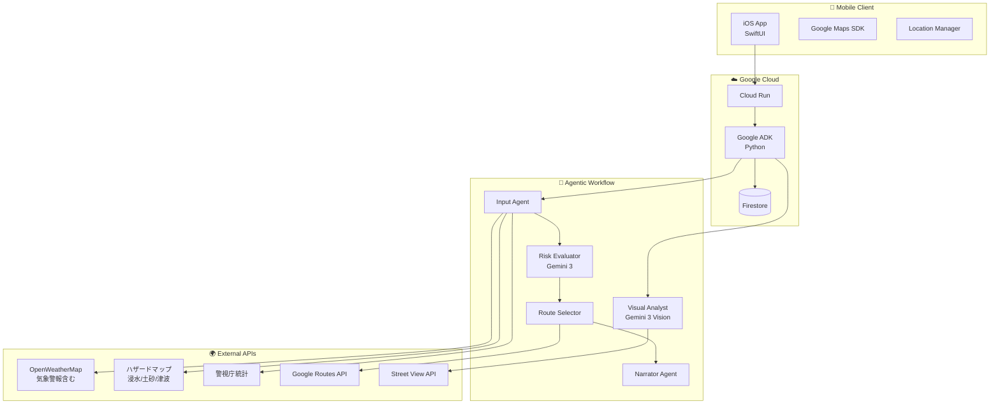

# 03_システムアーキテクチャ.md

## 1. 全体構成図 (Architecture Visualization)

本システムのアーキテクチャは、**Client-Server-Agent** の3層構造です。
クライアント（iOS）はUIとセンシングに専念し、複雑な意思決定は Backend 上の **Google ADK** が担います。

## 2. コンポーネント詳細

### ✅ Frontend (iOS App)
ユーザーインターフェースを提供します。
- **Google Maps SDK**: 地図描画・ポリライン表示を担当。
- **MVVM**: UIロジックと描画を分離し、テスト容易性を確保。
- **Server-Sent Events (SSE)**: AIの「思考ログ」をリアルタイムに受信・表示します。
- **自動モード切替**: 気象警報を検知し、非常時モードを自動起動。

### ✅ Backend (Google ADK + Cloud Run)
アプリケーションの脳みそとなる部分です。Google推奨の **Agent Development Kit (ADK)** を採用しています。
- **言語**: Python
- **デプロイ**: Cloud Run（コンテナベース）
- **Input Agent**: 複数の外部APIから「現在の状況（天気、災害リスク、治安）」を収集し、統合します。
- **Risk Evaluator (Gemini 3)**: 最新の **Gemini 3** モデルを使用し、収集したデータから「今の状況でこの道を通るべきか？」を人間のように推論します。
- **Route Selector**: Google Routes API を操作し、リスク評価に基づいた最適なルートを選定します。「全ルート危険」と判断した場合は、自律的に経由地を生成して再検索（Retry）を行います。

### ✅ External APIs (外部連携)
一般利用可能なAPIおよびオープンデータを採用しています。
- **Google Routes API**: 高度な経路探索（代替ルート取得）に使用。
- **OpenWeatherMap**: 商用利用可能な気象API。リアルタイムの雨量・風速・**気象警報（alerts）**を取得。
- **Google Street View Static API**: 地点の画像を動的に取得し、AIの視覚解析（明るさ・雰囲気スコア）に使用。
- **国土交通省ハザードマップ**: 浸水想定区域、土砂災害警戒区域、津波浸水想定区域のデータを使用。
- **警視庁オープンデータ**: 犯罪統計を事前加工した静的データとして利用。
