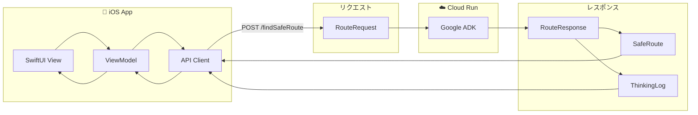
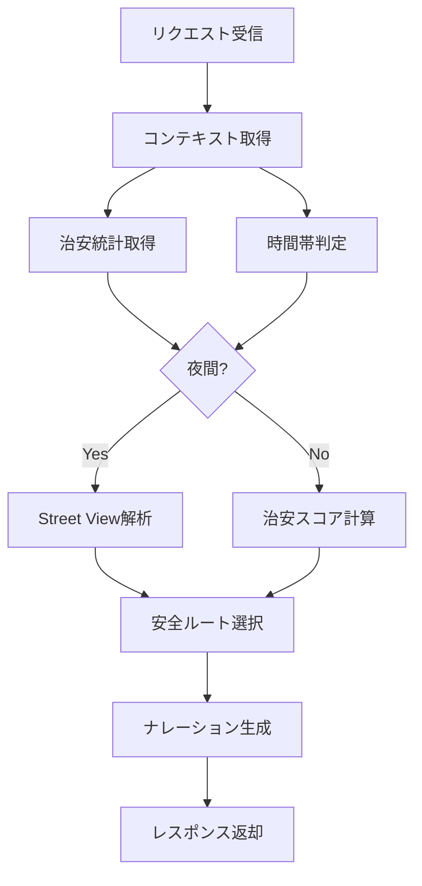
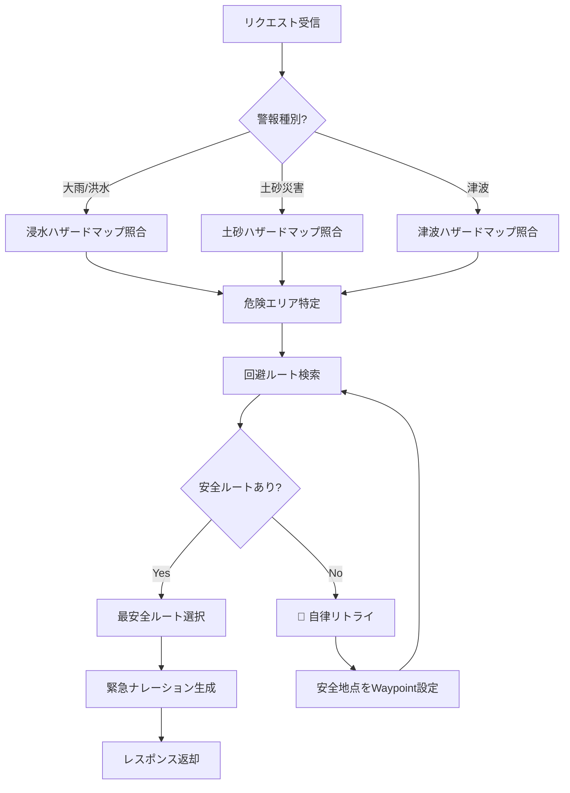

# 04_基本設計書.md

## 1. データモデル (Data Models)

### データフロー概要図



### RouteRequest (Client -> Server)
```python
@dataclass
class RouteRequest:
    origin: LatLng        # 出発地
    destination: LatLng   # 目的地
    mode: Literal["NORMAL", "EMERGENCY"]  # ユーザーモード
    alert_type: Optional[str] = None  # 気象警報種別（自動切替時）
```

### RouteResponse (Server -> Client)
```python
@dataclass
class RouteResponse:
    routes: List[SafeRoute]       # 提案ルート（複数）
    generated_waypoints: Optional[List[LatLng]]  # AIが生成した経由地
    narrative: str                # AIからの説明
    thinking_process_log: List[str]  # 思考ログ
    risk_assessment: RiskAssessment

@dataclass
class SafeRoute:
    polyline: str         # Encoded Polyline
    summary: str
    duration_seconds: int
    safety_score: int     # 0-100
    warnings: List[str]   # 特定のリスク警告

@dataclass
class RiskAssessment:
    level: Literal["LOW", "MEDIUM", "HIGH"]
    factors: List[str]    # "Flood Risk", "Tsunami Warning"
```

## 2. モード別処理フロー概要

### A. 通常モード (Normal)



**処理ステップ:**
1. **Request**: 目的地を設定。
2. **Context**: 治安統計・時間帯を確認。
3. **Logic**:
   - **日中**: 治安スコアを重視した安全ルートを選択。
   - **夜間**: 治安スコア + Street View解析（明るさ）を考慮。
4. **Response**: 「少し遠回りですが、明るい大通りを選びました」と提案。

### B. 非常時モード (Emergency)



**処理ステップ:**
1. **Request**: ユーザーが非常時スイッチON、または気象警報で自動切替。
2. **Context**: 警報の種類に応じて該当するハザードマップのみを照合。
3. **Logic**:
   - 危険エリアを特定し、回避ルートを検索。
   - 全ルート危険なら「自律リトライ（回避地点生成）」を実行。
4. **Response**: 「津波警報が発令されています。高台経由のルートに変更しました」と提案。
