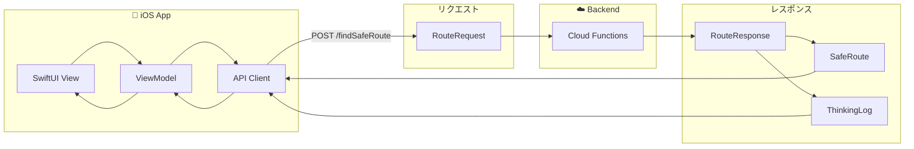
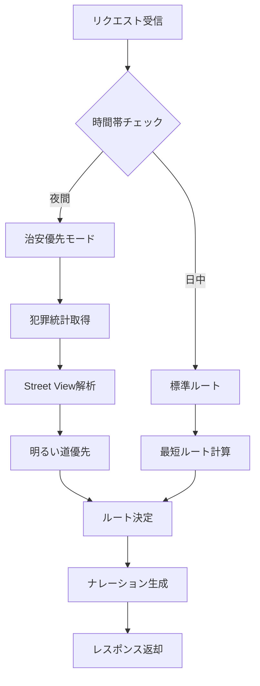
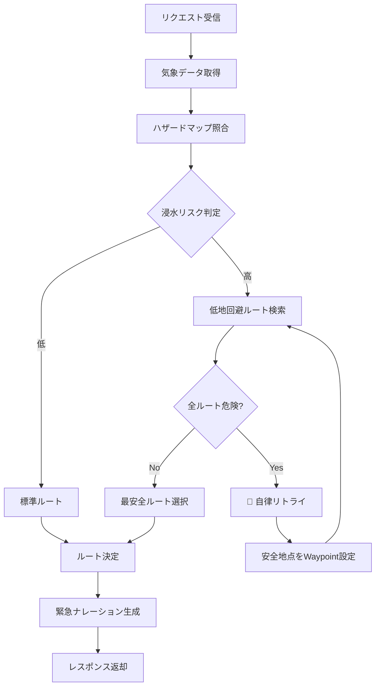

# 04_基本設計書.md

## 1. データモデル (Data Models)

### データフロー概要図



### RouteRequest (Client -> Server)
```typescript
interface RouteRequest {
  origin: LatLng;       // 出発地
  destination: LatLng;  // 目的地
  mode: "NORMAL" | "EMERGENCY"; // ユーザーモード
  preferences?: {
    avoidHighways?: boolean;
    optimizeFor?: "SAFETY" | "SPEED";
  };
}
```

### RouteResponse (Server -> Client)
```typescript
interface RouteResponse {
  routes: SafeRoute[];     // 提案ルート（複数）
  generatedWaypoints?: LatLng[]; // AIが生成した経由地（あれば）
  narrative: string;       // AIからの説明（Markdown）
  thinkingProcessLog: string[]; // 思考ログ
  riskAssessment: {
    level: "LOW" | "MEDIUM" | "HIGH";
    factors: string[]; // "Rain > 50mm", "Flood Risk"
  };
}

interface SafeRoute {
  polyline: string;        // Encoded Polyline
  summary: string;
  durationSeconds: number;
  safetyScore: number;     // 0-100
  warnings: string[];      // 特定のリスク警告
}
```

## 2. モード別処理フロー概要

### A. 通常モード (Normal)



**処理ステップ:**
1. **Request**: 目的地を設定。
2. **Context**: 現在の天気が「晴れ」かつ「夜間」とする。
3. **Logic**:
   - 最短ルートを検索。
   - ルート周辺の「犯罪発生率（統計）」をチェック。
   - 「街灯が少ないエリア」を回避する傾向を持たせる（Vision API連携）。
4. **Response**: 「少し遠回りですが、明るい大通りを選びました」と提案。

### B. 非常時モード (Emergency)



**処理ステップ:**
1. **Request**: ユーザーが非常時スイッチON or 目的地設定。
2. **Context**: 現在の天気が「豪雨」。
3. **Logic**:
   - 浸水ハザードマップと現在地を照合。
   - 低地エリアのノードコストを最大化。
   - ルート選定後、もし危険なら「自律リトライ（回避地点生成）」を実行。
4. **Response**: 「最短ルートは冠水の恐れがあります。高台経由のルートに変更しました」と提案。
