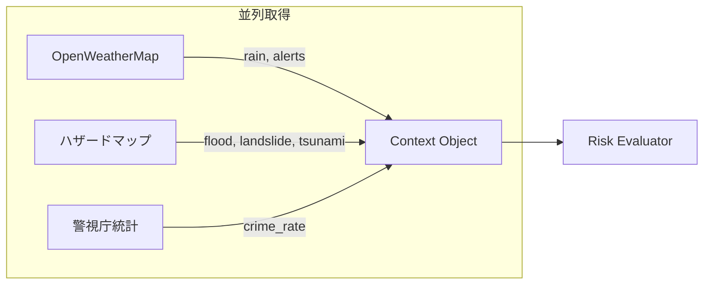
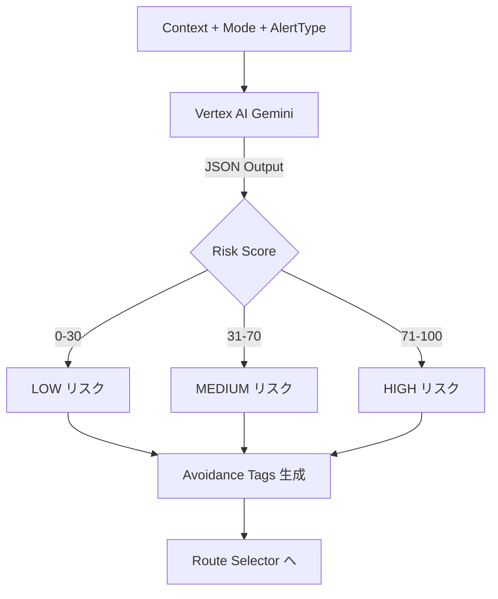
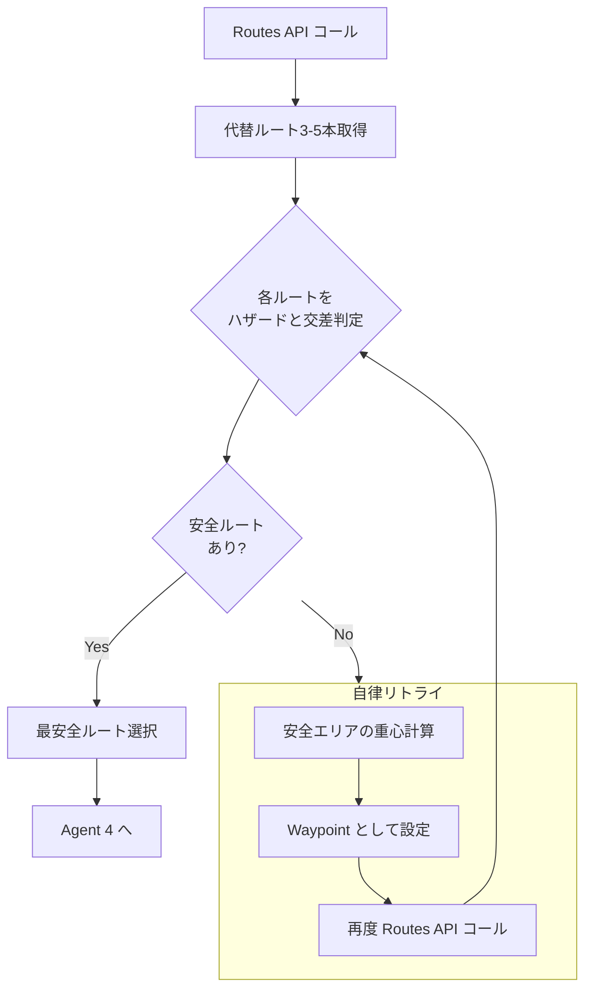
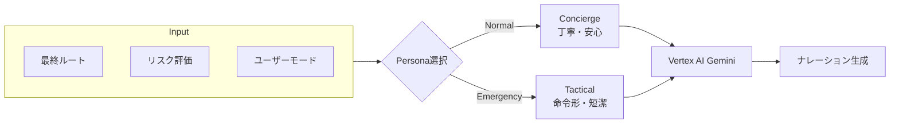
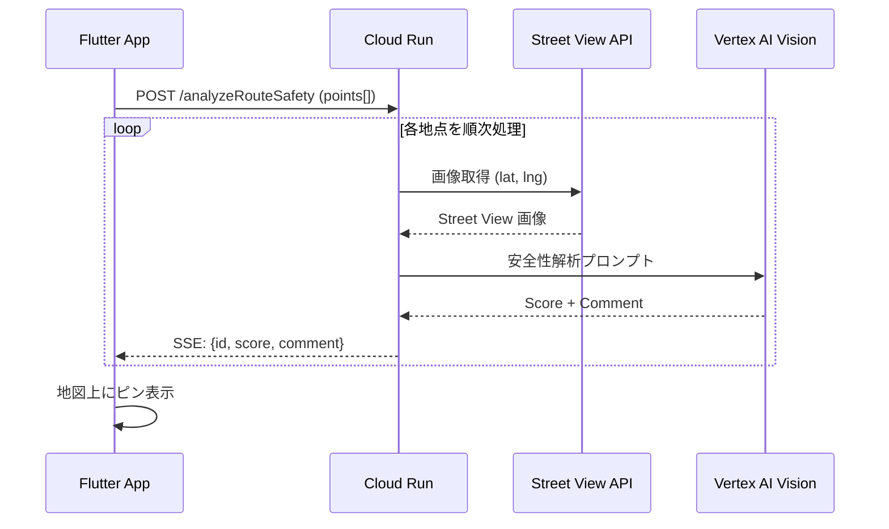

# 05_詳細設計書.md

## 1. Agentic Workflow 全体図


## 2. Agent別詳細設計

### Agent 1: Input Agent (情報収集)



- 並列実行 (`asyncio.gather`) で以下を取得し、コンテキストオブジェクトを作成する。
  - `weather`: { rain: 55mm/h, alerts: ["大雨警報"] }
  - `hazard`: { flood_depth: 0.5m, landslide_risk: "low", tsunami_risk: "none" }
  - `crime`: { area_score: 72 }

### Agent 2: Risk Evaluator (リスク評価)



- **入力**: コンテキスト + モード + 警報種別
- **処理**: **Vertex AI (Gemini)** を使用し、JSON形式でリスク係数を算出。
- **Output Schema**:
  ```json
  {
    "baseRiskScore": 85,
    "avoidanceTags": ["LOW_ELEVATION", "COASTAL_AREA"],
    "priority": "SURVIVAL",
    "selectedHazard": "TSUNAMI"
  }
  ```

### Agent 3: Route Selector (経路探索 & 自律リトライ)



- **Step 1**: Google Routes API (computeRoutes) をコール。
- **Step 2**: 取得した Polyline と該当ハザードマップ（GeoJSON）を交差判定。
- **Step 3 (The Agentic Loop)**: 全ルート危険時は自律的にWaypointを生成してリトライ。

### Agent 4: Narrator (ナレーター)



## 3. 非同期安全性スキャン (Async Visual Analysis)



## 4. エラーハンドリング & フォールバック

| API | 失敗時の挙動 |
| :--- | :--- |
| **OpenWeatherMap** | キャッシュ済みの直近データを使用。キャッシュがない場合はリスク評価を「中」で継続。 |
| **Google Routes API** | 事前に定義したモックルート（渋谷エリア用）を返却。 |
| **Street View Static API** | 該当地点のスコアをスキップし、次の地点へ進む。 |
| **Vertex AI (Gemini)** | タイムアウト時は固定の汎用メッセージを返す。 |
