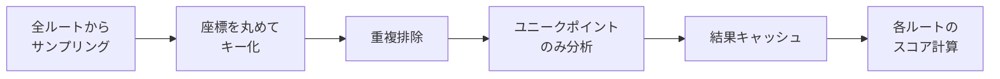
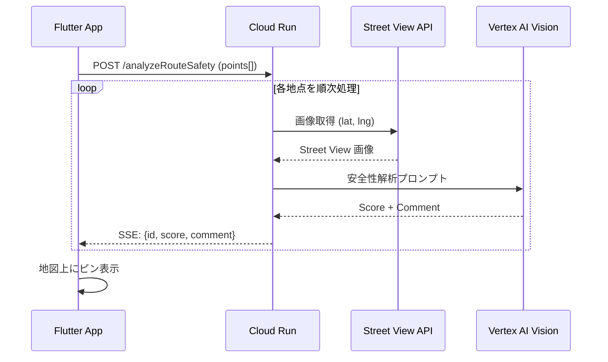

# 05_詳細設計書.md

## 1. Agentic Workflow 全体図

## 2. Agent別詳細設計

## 2. Agent別詳細設計 (True Agentic Architecture)

### 🕵️ The Sentinel (司令塔 / Dispatcher)
システムの中枢。Gemini 3 Pro の推論能力(CoT)を活かし、状況判断とタスクの振り分けを行う。
- **機能**:
    1.  **Observation**: ユーザー入力やNavigatorからのデータを観察。
    2.  **Reasoning**: 「今は安全か？」「視覚情報が必要か？」を推論。
    3.  **Routing**: NavigatorやAnalystに指示を出す。

### 🗺️ The Navigator (探索 / Tool User)
実務担当。外部APIを駆使して情報を集め、ルートを計算する。
- **モデル**: Gemini 3 Flash (高速性重視)
- **Tools**:
    - `find_routes`: Routes APIで経路探索。
    - `check_risks`: OpenWeatherMap, ハザードマップ, Solar API, Places API, 犯罪統計を一括チェック。

### 👁️ The Analyst (視覚 / Vision)
視覚担当。必要な場合のみSentinelから呼び出される。
- **モデル**: Gemini 3 Flash (Multimodal)
- **Tools**:
    - `analyze_street_view`: 座標から画像を引いてリスク評価。

### 🛡️ The Guardian (守護者 / Narrator)
ユーザー対話担当。Sentinelの決定をユーザーに伝える。
- **モデル**: Gemini 3 Pro (対話品質重視)
- **機能**:
    - **Normal Mode**: コンシェルジュのような丁寧な案内。
    - **Emergency Mode**: 短く的確な指示と、安心させる言葉がけ。

## 3. リスク評価ロジック詳説（ポリライン分解）

ユーザーの安全をきめ細かく評価するため、ルート全体をひとまとめにするのではなく、分解して評価します。

### 3.1 ポリライン分解とサンプリング戦略 (Route Sampling)
グリッド方式ではなく、**Route Sampling方式**（ルートに沿って点を評価する）を採用します。
これにより、実際にユーザーが通る道の安全性だけをピンポイントで評価でき、APIコストも最適化されます。

1.  **セグメント分解**: Google Routes APIから得られたPolylineを **50m間隔** でサンプリングします。
    - 日本の街灯間隔（約30-50m）を考慮し、暗い区間を見逃さないための設定です。
2.  **重要ポイント**: 「交差点（Turn）」や「信号待ちが発生するポイント」は50m間隔にかかわらず必ず評価点に追加します。

### 3.2 マルチモーダル評価アルゴリズム (各ポイントごと)

各サンプリングポイント $P_i$ に対し、以下のスコア $S_i$ を算出します。

$$ S_i = w_1 \cdot C(P_i) + w_2 \cdot E(P_i) + w_3 \cdot V(P_i) $$

- **$C(P_i)$ 犯罪リスク (Crime)**:
  - 警視庁オープンデータ（Firestore + Geohash）から周辺の犯罪発生率を取得。
- **$E(P_i)$ 環境リスク (Environment)**:
  - **Solar API**: `sunshine_hours` が低い = 建物等の影が多い = **「夜道が暗い」** と判定 (+Risk)。
  - **Places API**: 半径100m以内に「逃げ込める場所 (コンビニ, 交番, 駅)」があるか判定 (-Risk)。
  - **OpenWeatherMap**: 浸水エリアに含まれるか判定 (+Risk)。
- **$V(P_i)$ 視覚リスク (Vision)**:
  - *非同期実行*: Street View画像をGemini Visionで解析。「街灯がない」「落書きが多い」などを検知。

### 3.3 総合スコア算出 (Bottleneck Evaluation)
ルート全体の推奨度は、平均点ではなく **「ボトルネック（最低点）」** で決まります。
「99%安全でも、1か所だけ極めて危険な路地があるなら、そのルートは推奨しない」という設計思想です。

> 詳しくは [ロジック図参照](Docs/確定/diagrams/15_リスク評価ロジック.md)

### 3.4 複数ルート重複排除 (Batch Deduplication)

複数のルート候補を同時に分析する際、重複するポイントを1回だけ分析する最適化を行います。

**問題**: 出発地・目的地付近で複数ルートが同じ道を通る場合、同じポイントが複数回分析される。

**座標のキー化ルール**:
- `(lat, lng)` を小数点以下4桁で丸める（約11m精度）
- 50mサンプリング間隔に対して妥当な閾値

**期待効果**: API呼び出し回数 20-50%削減（Vision AI, Street View）

## 4. 非同期安全性スキャン (Async Visual Analysis)

## 5. エラーハンドリング & フォールバック

| API | 失敗時の挙動 |
| :--- | :--- |
| **OpenWeatherMap** | キャッシュ済みの直近データを使用。キャッシュがない場合はリスク評価を「中」で継続。 |
| **Google Routes API** | 事前に定義したモックルート（渋谷エリア用）を返却。 |
| **Street View Static API** | 該当地点のスコアをスキップし、次の地点へ進む。 |
| **Vertex AI (Gemini)** | タイムアウト時は固定の汎用メッセージを返す。 |
