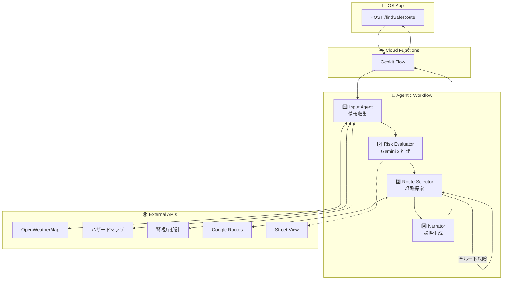
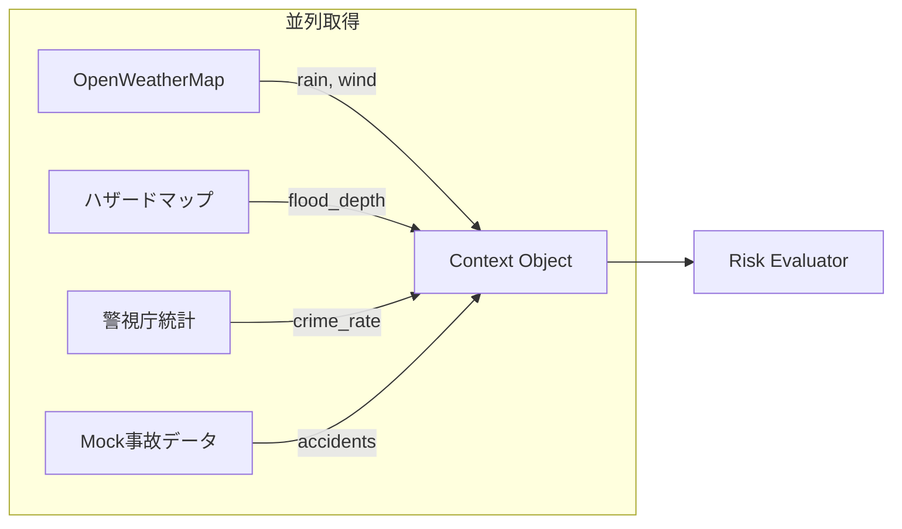
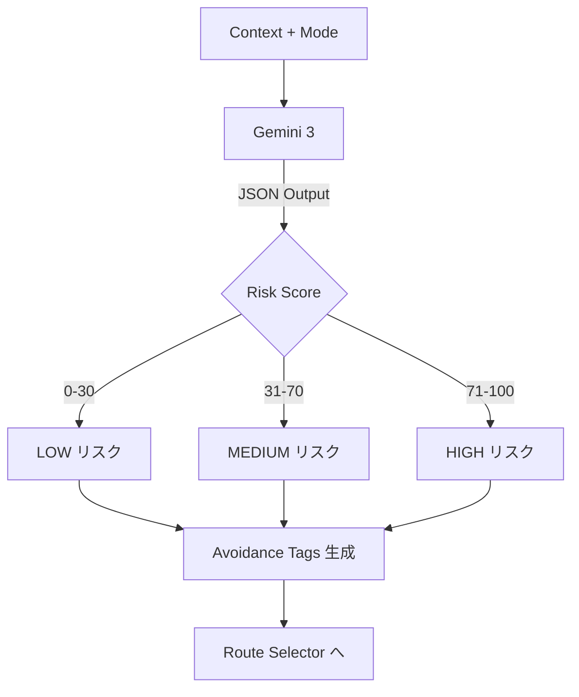
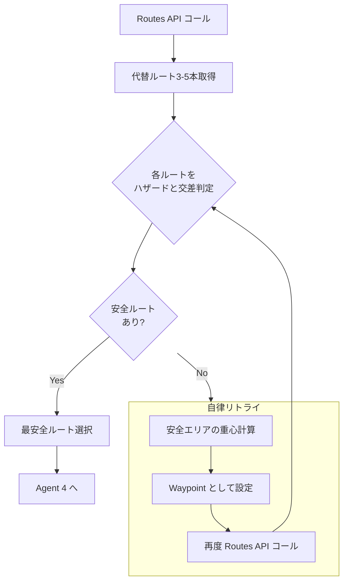
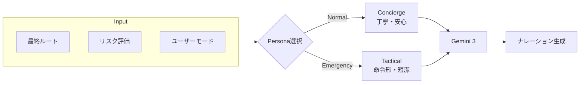
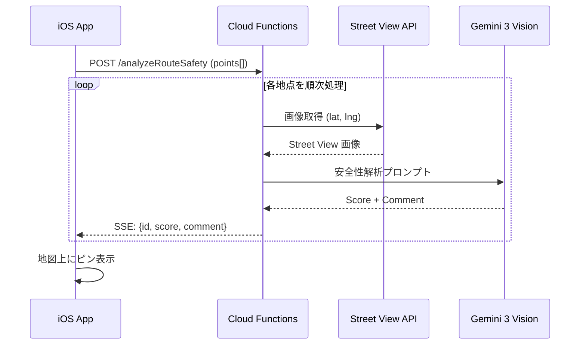
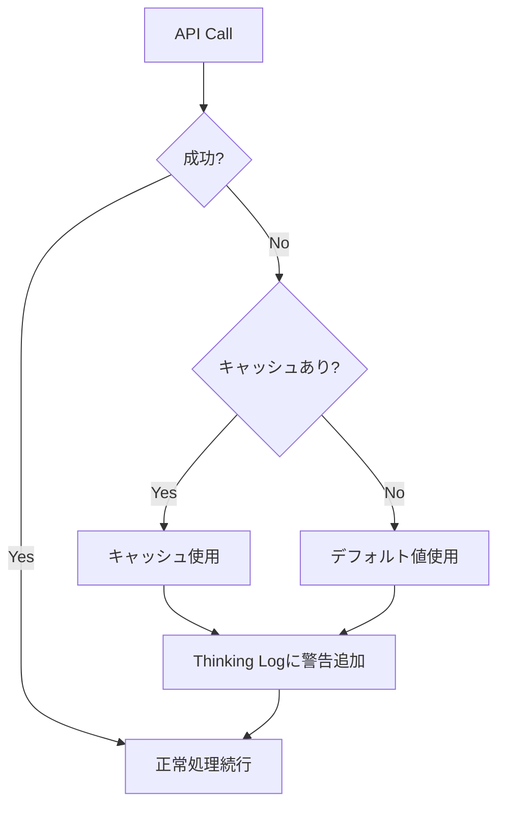

# 05_詳細設計書.md

## 1. Agentic Workflow 全体図



## 2. Agent別詳細設計

### Agent 1: Input Agent (情報収集)



- 並列実行 (`Promise.all`) で以下を取得し、コンテキストオブジェクトを作成する。
  - `weather`: { rain: 55mm/h, wind: 15m/s }
  - `hazard`: { floodDepth: 0.5m, landslideRisk: low }
  - `traffic`: { accidents: [ConfiguredMockData] }

### Agent 2: Risk Evaluator (リスク評価)



- **入力**: コンテキスト + モード
- **処理**: **Gemini 3** を使用し、JSON形式でリスク係数を算出。
- **Output Schema**:
  ```json
  {
    "baseRiskScore": 85,
    "avoidanceTags": ["LOW_ELEVATION", "RIVER_SIDE"],
    "priority": "SURVIVAL"
  }
  ```

### Agent 3: Route Selector (経路探索 & 自律リトライ)



- **Step 1**: Google Routes API (computeRoutes) をコール。
  - `computeAlternativeRoutes: true`
  - `routingPreference: TRAFFIC_AWARE`
- **Step 2**: 取得した Polyline とハザードマップ（GeoJSON）を交差判定。
- **Step 3 (The Agentic Loop)**: 全ルート危険時は自律的にWaypointを生成してリトライ。

### Agent 4: Narrator (ナレーター)



- **入力**: 最終決定ルート + リスク評価 + ユーザーモード
- **処理**: **Gemini 3** を使用し、Personaに基づいてテキスト生成。

## 3. 非同期安全性スキャン (Async Visual Analysis)



- メインのルートレスポンスとは切り離し、別エンドポイント `/analyzeRouteSafety` またはSSEストリームで提供。
- **Input**: ルート上のサンプリング座標（500mごと or 交差点）。
- **Output**: `{ lat, lng, score, comment }` を順次クライアントにプッシュ。

## 4. エラーハンドリング & フォールバック

### API失敗時の挙動



| API | 失敗時の挙動 |
| :--- | :--- |
| **OpenWeatherMap** | キャッシュ済みの直近データを使用。キャッシュがない場合は「天気データ取得失敗」としてリスク評価を「中」で継続。 |
| **Google Routes API** | 事前に定義したモックルート（渋谷エリア用）を返却し、デモを継続。 |
| **Street View Static API** | 該当地点のスコアをスキップし、次の地点へ進む。 |
| **Gemini 3** | タイムアウト時は固定の汎用メッセージを返す。 |
