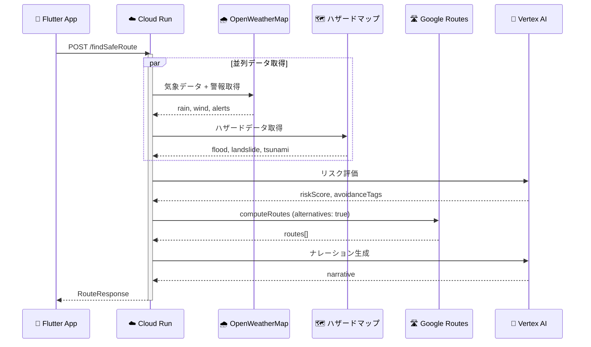
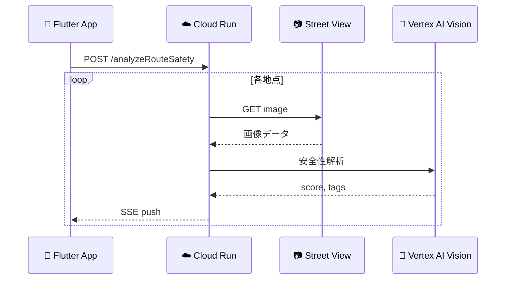

# 06_API仕様書.md

## 1. API呼び出しシーケンス



## 2. Backend Endpoints (Cloud Run)

### `POST /findSafeRoute`
- **概要**: メインの経路探索API。
- **Auth**: API Key (Header: `X-App-Check`)
- **Request**:
    ```json
    {
      "origin": {"lat": 35.6812, "lng": 139.7671},
      "destination": {"lat": 35.6591, "lng": 139.7006},
      "mode": "EMERGENCY",
      "alert_type": "TSUNAMI"
    }
    ```
- **Response (Success)**:
    ```json
    {
      "routes": [
        {
          "polyline": "encoded_polyline_string",
          "summary": "高台経由ルート",
          "duration_seconds": 900,
          "safety_score": 85,
          "warnings": ["津波浸水エリア回避"]
        }
      ],
      "narrative": "津波警報が発令されています。高台を経由する安全なルートを設定しました。",
      "thinking_process_log": ["Fetching weather...", "Alert: TSUNAMI", "Rerouting..."],
      "risk_assessment": {
        "level": "HIGH",
        "factors": ["Tsunami Warning", "Coastal Area"]
      }
    }
    ```
- **Response (Error / Fallback)**:
    ```json
    {
      "routes": [...],
      "narrative": "一部データの取得に失敗しましたが、安全なルートを設定しました。",
      "thinking_process_log": ["[Warning] Weather API timeout.", "Using cached data."],
      "error": {
        "code": "PARTIAL_DATA_FAILURE",
        "message": "OpenWeatherMap API timed out."
      }
    }
    ```

### `POST /analyzeRouteSafety` (Async Optional)



- **概要**: 指定された座標リストの「視覚的安全性」を解析する。
- **Timeout**: 各地点につき最大3秒。失敗時はスキップ。

## 3. External API Usage

### Google Routes API (`v2.computeRoutes`)
- **Method**: POST
- **FieldMask**: `routes.duration,routes.distanceMeters,routes.polyline.encodedPolyline`
- **Note**: `X-Goog-FieldMask` ヘッダーが必須。
- **Fallback**: 失敗時は事前定義のモックルートを使用。

### OpenWeatherMap (One Call 3.0)
- **Endpoint**: `https://api.openweathermap.org/data/3.0/onecall`
- **Params**: `lat`, `lon`, `exclude=minutely,daily`, `appid`
- **重要**: `alerts` フィールドで気象警報を取得（自動モード切替に使用）。
- **Fallback**: 失敗時はキャッシュデータを使用。

### Google Street View Static API
- **Endpoint**: `https://maps.googleapis.com/maps/api/streetview`
- **Params**: `size=600x400`, `location=lat,lng`, `source=outdoor`, `key`
- **Fallback**: 画像取得失敗時はその地点をスキップ。
