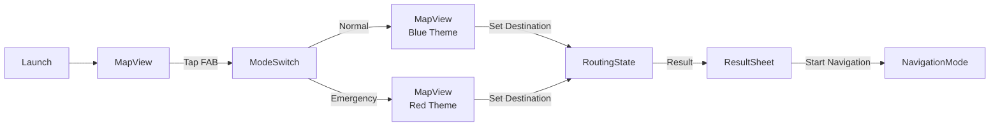

# 07_UIデザイン仕様書.md

## 1. 画面遷移図

## 2. 技術スタック (Flutter)

| パッケージ | 用途 |
| :--- | :--- |
| `google_maps_flutter` | 地図表示、ポリライン描画 |
| `geolocator` | 位置情報取得 |
| `flutter_riverpod` | 状態管理 |
| `dio` | HTTP通信（Backend API呼び出し） |
| `sse_client` または `EventSource` | Server-Sent Events（思考ログ受信） |

## 3. モード別デザイン定義

### A. 日常モード (Normal)
- **Primary Color**: Blue (`0xFF007AFF`)
- **Map Style**: Standard (Google Maps default)
- **Overlays**:
    - **Heatmap**: 青〜緑のグラデーション（透過50%）で治安の良いエリアを表示。
    - **Safety Pins**: 視覚解析が終わった地点に「✨」アイコンを表示。
- **Message Tone**: 親切、安心感（例: "明るい道を案内しますね。"）

### B. 非常時モード (Emergency)
- **Primary Color**: Red (`0xFFFF3B30`) & Dark Background (`0xFF1C1C1E`)
- **Map Style**: Dark Mode (Custom Cloud Style)
    - 建物を暗く、道路と水域（青）を目立たせるスタイル。
- **Overlays**:
    - **Hazard Area**: 赤の半透明ポリゴン（opacity 0.4、点滅アニメーション）。
    - **Route Line**: 蛍光オレンジ (`0xFFFF9500`)、線幅 6pt。
- **Message Tone**: 緊急、命令形（例: "警告。大雨です。高台へ移動してください。"）

## 4. UIコンポーネント詳細

### FAB (Floating Action Button) - モード切替
- **位置**: 画面右下。マージン: 右16dp、下24dp。
- **サイズ**: 56dp（Material Design標準）
- **アイコン**: 日常モード時は`Icons.wb_sunny`、非常時は`Icons.warning`。
- **アニメーション**: タップ時にスケール(1.0 → 0.9 → 1.0)、Haptic Feedback。

### ボトムシート (Result Sheet)
- **表示トリガー**: ルート計算完了時。
- **高さ**: 画面高さの 30% (min)、ドラッグで 70% まで拡張可能。
- **コンテンツ**:
    - ルート概要（所要時間、距離、safetyScore）
    - AIナレーション（Markdownサポート）
    - 「ナビ開始」ボタン（高さ50dp、幅100%、角丸12dp）

### Thinking Log Overlay
- **位置**: 画面下部（ボトムシートの上）。Mapの上にオーバーレイ。
- **サイズ**: 高さ 80dp、幅 100%。
- **背景**: 黒 (`0xFF000000`)、透過 70%。
- **フォント**: `RobotoMono`、サイズ 12sp、色 `0xFF00FF00` (緑)。
- **Animation**: Typewriter Effect (1文字ずつ表示、50ms間隔)。

## 5. アクセシビリティ対応

- **タップターゲット**: すべてのインタラクティブ要素は最小 **48x48dp** を確保（Material Design）。
- **コントラスト比**: テキストと背景のコントラスト比は **WCAG 2.1 AA (4.5:1)** 以上。
- **Semantics**: すべてのボタン・アイコンに `Semantics` ウィジェットで label を設定。
