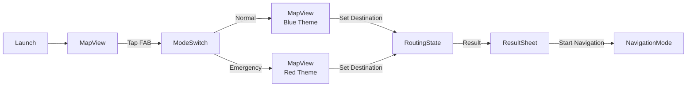

# 07_UIデザイン仕様書.md

## 1. 画面遷移図



## 2. モード別デザイン定義

### A. 日常モード (Normal)
- **Base Color**: System Blue (`#007AFF`)
- **Map Style**: Standard (Google Maps default)
- **Overlays**:
    - **Heatmap**: 青〜緑のグラデーション（透過50%）で治安の良いエリアを表示。
    - **Safety Pins**: 視覚解析が終わった地点に「✨」アイコンを表示。
- **Message Tone**: 親切、安心感（例: "明るい道を案内しますね。"）

### B. 非常時モード (Emergency)
- **Base Color**: System Red (`#FF3B30`) & Black Background (`#1C1C1E`)
- **Map Style**: Dark Mode (Custom Cloud Style)
    - 建物を暗く、道路と水域（青）を目立たせるスタイル。
- **Overlays**:
    - **Hazard Area**: 赤の半透明ポリゴン（opacity 0.4、点滅アニメーション 0.5秒周期）。
    - **Route Line**: 蛍光オレンジ (`#FF9500`)、線幅 6pt。
- **Message Tone**: 緊急、命令形（例: "警告。大雨です。高台へ移動してください。"）

## 3. UIコンポーネント詳細

### FAB (Floating Action Button) - モード切替
- **位置**: 画面右下、Safe Area内。マージン: 右16pt、下24pt。
- **サイズ**: 直径 **60pt** (44ptの最小タップターゲットを満たす)。
- **アイコン**: 日常モード時は`sun.max.fill`、非常時は`exclamationmark.triangle.fill`。
- **アニメーション**: タップ時にスケール(1.0 → 0.9 → 1.0)、Haptic Feedback (`UIImpactFeedbackGenerator.medium`)。

### ボトムシート (Result Sheet)
- **表示トリガー**: ルート計算完了時。
- **高さ**: 画面高さの 30% (min)、スワイプで 70% まで拡張可能。
- **コンテンツ**:
    - ルート概要（所要時間、距離、safetyScore）
    - AIナレーション（Markdownサポート）
    - 「ナビ開始」ボタン（高さ50pt、幅100%、角丸12pt）

### Thinking Log Overlay
- **位置**: 画面下部（ボトムシートの上）。Mapの上にオーバーレイ。
- **サイズ**: 高さ 80pt、幅 100%。
- **背景**: 黒 (`#000000`)、透過 70%。
- **フォント**: `SF Mono`、サイズ 12pt、色 `#00FF00` (緑)。
- **Animation**: Typewriter Effect (1文字ずつ表示、50ms間隔)。
- **Content 例**:
  ```
  > Fetching weather data... (Rain: 52mm/h)
  > Risk Level: HIGH
  > Rerouting to avoid low elevation...
  > Route Found.
  ```

## 4. アクセシビリティ対応 (Apple HIG準拠)

- **タップターゲット**: すべてのインタラクティブ要素は最小 **44x44pt** を確保。
- **コントラスト比**: テキストと背景のコントラスト比は **WCAG 2.1 AA (4.5:1)** 以上。
- **VoiceOver**: すべてのボタン・アイコンに `accessibilityLabel` を設定。
- **Dynamic Type**: フォントサイズはシステム設定に追従（ただし Thinking Log は固定）。
