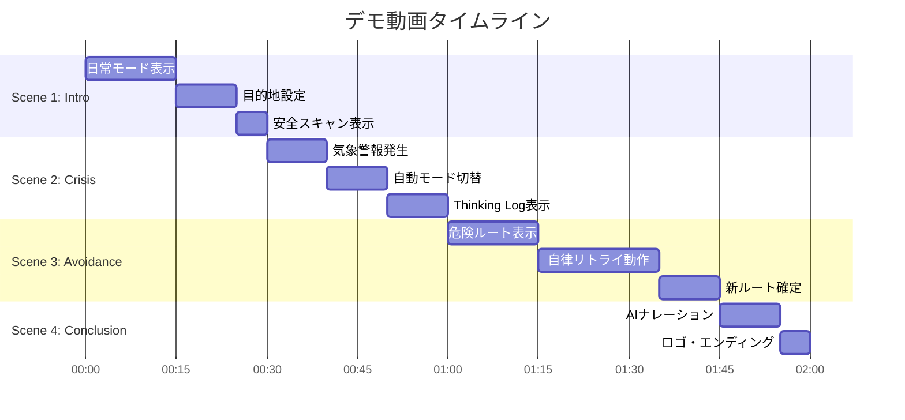
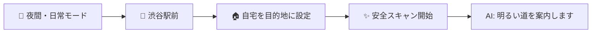
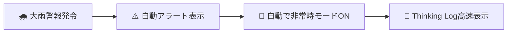
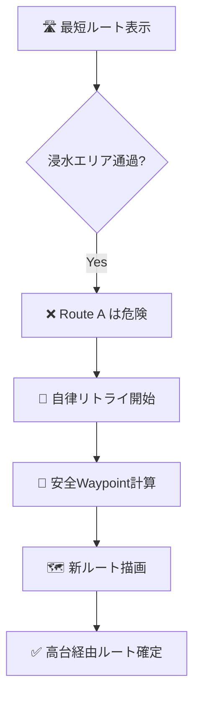
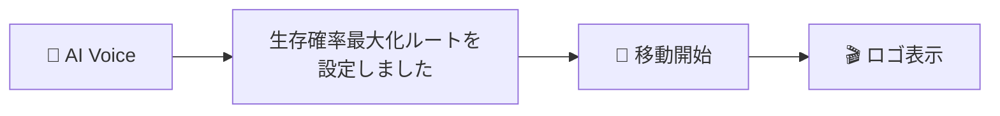
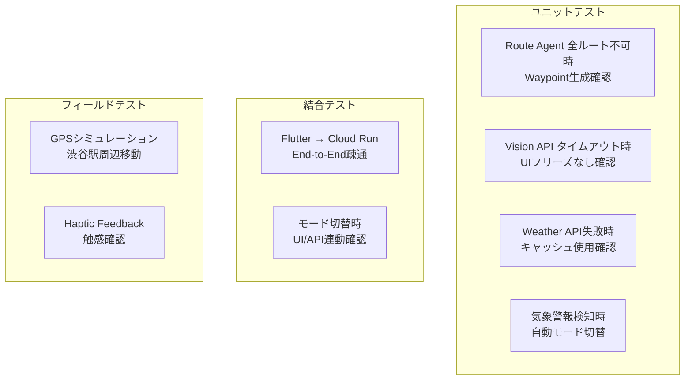

# 09_デモシナリオ・テスト計画書.md

## 1. デモ動画シナリオ (Target: 2-3 mins)

### ストーリーボード (タイムライン)



### Scene 1: Intro (0:00 - 0:30)



- **Visual**: 日常モード（青）。渋谷駅前の明るい地図。
- **Action**: 「駅から自宅へ」をセット。
- **AI Voice**: 「お疲れ様です。今日は少し遅いので、人通りの多い明るい道を案内しますね。」
- **Highlight**: **Async Safety Scan** で地図上に「✨」がポンポンと表示される様子を見せる。

### Scene 2: The Crisis (0:30 - 1:00)



- **Visual**: 突然のアラート音。APIから「大雨警報」を検知。
- **Action**: **自動的に**非常時モード（赤）に切り替わる。
- **UI Change**: 画面が一瞬で赤黒くなり、Thinking Logが高速で流れる。
  ```
  > ⚠️ WEATHER ALERT DETECTED: 大雨警報
  > AUTO-SWITCHING TO EMERGENCY MODE
  > RISK ASSESSMENT: FLOOD HAZARD HIGH
  ```

### Scene 3: The Avoidance (1:00 - 1:45)



- **Visual**: 当初の最短ルートが「浸水エリア（赤ポリゴン）」を通過しているのが見える。
- **AI Action (Agentic Loop)**:
  - ログ: `> Route A is dangerous. Calculating detour...`
  - 地図上でAIが「代わりの地点（Waypoint）」を探し、線を書き換えるアニメーション。
- **Result**: 危険エリアを大きく迂回する新しいルートが確定。

### Scene 4: Conclusion (1:45 - 2:00)



- **AI Voice**: 「生存確率最大化ルートを設定しました。直ちに移動を開始してください。」
- **Outro**: "Situation-Adaptive Safe Routing AI" ロゴ。

## 2. テスト計画

### テストケース一覧



### Unit Test
- Route Agentが「全ルート不可」の時に正しくWaypointを生成するか？
- Vision APIがタイムアウトした時にUIがフリーズしないか？
- **気象警報（alerts）を検知した時に自動でモード切替が発動するか？**

### Field Test (Simulation)
- GPSシミュレータ（Android Emulator / iOS Simulator）を使用し、渋谷駅周辺を移動するシミュレーションを行う。
- 実機で「モード切替」の触確（Haptic Feedback）が心地よいか確認。

## 3. デモ撮影チェックリスト

| 項目 | 確認内容 | ✓ |
| :--- | :--- | :---: |
| 画面録画設定 | 60fps, 1080p以上 | ☐ |
| モックデータ準備 | 大雨警報データ（OpenWeatherMap形式） | ☐ |
| BGM/SE | アラート音、モード切替音 | ☐ |
| ナレーション | AI Voiceの音声出力確認 | ☐ |
| Thinking Log速度 | 読める速度に調整済み | ☐ |
| 自動切替演出 | 警報検知→赤画面への遷移がスムーズか | ☐ |
