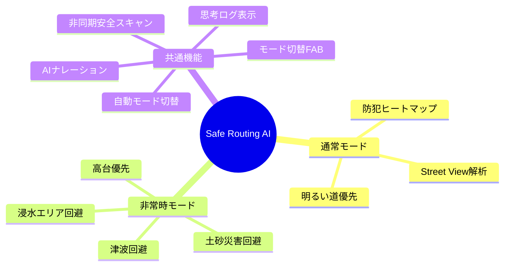

# 機能一覧 (Mindmap)

```mermaid
mindmap
  root((Safe Routing AI))
    通常モード
      防犯ヒートマップ
      Street View解析
      明るい道優先
    非常時モード
      浸水エリア回避
      土砂災害回避
      津波回避
      高台優先
    共通機能
      モード切替FAB
      自動モード切替
      AIナレーション
      思考ログ表示
      非同期安全スキャン
```
