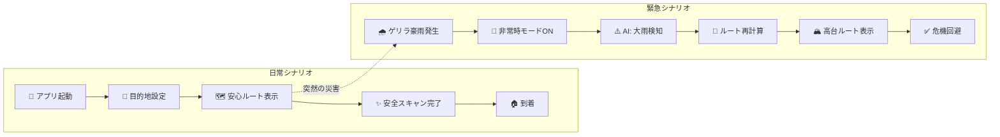

# ユーザージャーニー

```mermaid
flowchart LR
    subgraph 日常シナリオ
        A1[🚶 アプリ起動] --> A2[📍 目的地設定]
        A2 --> A3[🗺️ 安心ルート表示]
        A3 --> A4[✨ 安全スキャン完了]
        A4 --> A5[🏠 到着]
    end

    subgraph 緊急シナリオ
        B1[🌧️ ゲリラ豪雨発生] --> B2[🔴 非常時モードON]
        B2 --> B3[⚠️ AI: 大雨検知]
        B3 --> B4[🔄 ルート再計算]
        B4 --> B5[🏔️ 高台ルート表示]
        B5 --> B6[✅ 危機回避]
    end

    A3 -.->|突然の災害| B1
```
