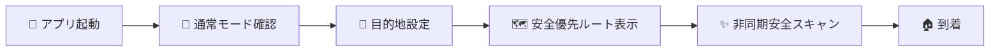
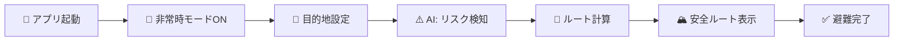

# ユーザージャーニー

## 日常シナリオ（通常モード）

```mermaid
flowchart LR
    A[🚶 アプリ起動] --> B[🔵 通常モード確認]
    B --> C[📍 目的地設定]
    C --> D[🗺️ 安全優先ルート表示]
    D --> E[✨ 非同期安全スキャン]
    E --> F[🏠 到着]
```

## 緊急シナリオ（非常時モード）

```mermaid
flowchart LR
    A[🚶 アプリ起動] --> B[🔴 非常時モードON]
    B --> C[📍 目的地設定]
    C --> D[⚠️ AI: リスク検知]
    D --> E[🔄 ルート計算]
    E --> F[🏔️ 安全ルート表示]
    F --> G[✅ 避難完了]
```

## 補足
- **日常→緊急の切り替え**: ユーザーが状況に応じて手動でモードを切り替える設計
- **自動切り替え（将来）**: 気象警報APIと連携して自動切り替えも可能（MVP外）
