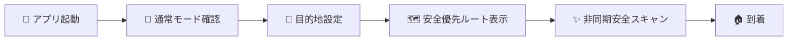
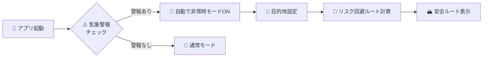
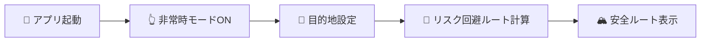

# ユーザージャーニー

## 日常シナリオ（通常モード）

```mermaid
flowchart LR
    A[🚶 アプリ起動] --> B[🔵 通常モード確認]
    B --> C[📍 目的地設定]
    C --> D[🗺️ 安全優先ルート表示]
    D --> E[✨ 非同期安全スキャン]
    E --> F[🏠 到着]
```

## 緊急シナリオ（自動切り替え）

```mermaid
flowchart LR
    A[🚶 アプリ起動] --> B{⚠️ 気象警報<br/>チェック}
    B -->|警報あり| C[🔴 自動で非常時モードON]
    B -->|警報なし| D[🔵 通常モード]
    C --> E[📍 目的地設定]
    E --> F[🔄 リスク回避ルート計算]
    F --> G[🏔️ 安全ルート表示]
```

## 緊急シナリオ（手動切り替え）

```mermaid
flowchart LR
    A[🚶 アプリ起動] --> B[👆 非常時モードON]
    B --> C[📍 目的地設定]
    C --> D[🔄 リスク回避ルート計算]
    D --> E[🏔️ 安全ルート表示]
```

## 自動モード切り替えのトリガー
- OpenWeatherMap API の `alerts` に気象警報が含まれている場合
- 例: 大雨警報、洪水警報、暴風警報
