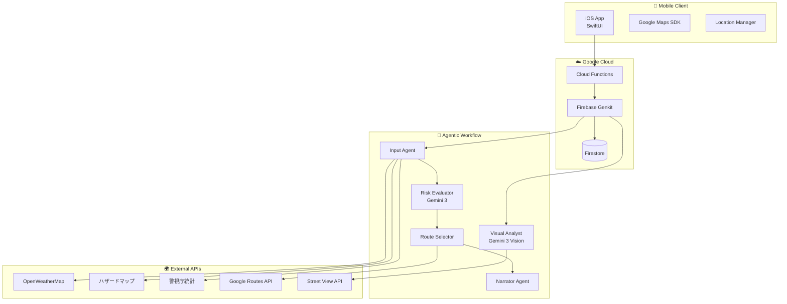

# システム全体構成図

```mermaid
flowchart TB
    subgraph Client["📱 Mobile Client"]
        iOS["iOS App<br/>SwiftUI"]
        MapsSDK["Google Maps SDK"]
        GPS["Location Manager"]
    end

    subgraph Backend["☁️ Google Cloud"]
        Functions["Cloud Functions"]
        Genkit["Firebase Genkit"]
        Firestore[("Firestore")]
    end

    subgraph Agents["🤖 Agentic Workflow"]
        InputAgent["Input Agent"]
        RiskAgent["Risk Evaluator<br/>Gemini 3"]
        RouteAgent["Route Selector"]
        VisionAgent["Visual Analyst<br/>Gemini 3 Vision"]
        Narrator["Narrator Agent"]
    end

    subgraph APIs["🌍 External APIs"]
        WeatherAPI["OpenWeatherMap"]
        HazardAPI["ハザードマップ"]
        PoliceData["警視庁統計"]
        RoutesAPI["Google Routes API"]
        StreetView["Street View API"]
    end

    iOS --> Functions
    Functions --> Genkit
    Genkit --> Firestore
    
    Genkit --> InputAgent
    InputAgent --> RiskAgent
    RiskAgent --> RouteAgent
    RouteAgent --> Narrator
    Genkit --> VisionAgent

    InputAgent --> WeatherAPI
    InputAgent --> HazardAPI
    InputAgent --> PoliceData
    RouteAgent --> RoutesAPI
    VisionAgent --> StreetView
```
