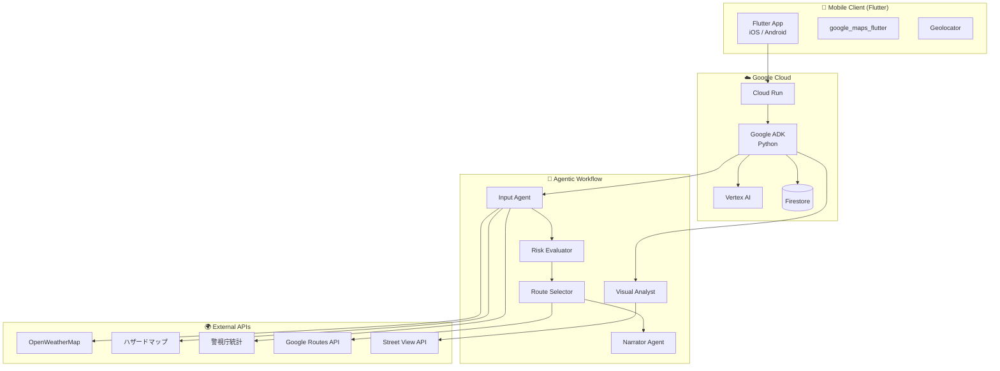

# システム全体構成図

```mermaid
flowchart TB
    subgraph Client["📱 Mobile Client (Flutter)"]
        Flutter["Flutter App<br/>iOS / Android"]
        MapsSDK["google_maps_flutter"]
        GPS["Geolocator"]
    end

    subgraph Backend["☁️ Google Cloud"]
        CloudRun["Cloud Run"]
        ADK["Google ADK<br/>Python"]
        VertexAI["Vertex AI"]
        Firestore[("Firestore")]
    end

    subgraph Agents["🤖 Agentic Workflow"]
        InputAgent["Input Agent"]
        RiskAgent["Risk Evaluator"]
        RouteAgent["Route Selector"]
        VisionAgent["Visual Analyst"]
        Narrator["Narrator Agent"]
    end

    subgraph APIs["🌍 External APIs"]
        WeatherAPI["OpenWeatherMap"]
        HazardAPI["ハザードマップ"]
        PoliceData["警視庁統計"]
        RoutesAPI["Google Routes API"]
        StreetView["Street View API"]
    end

    Flutter --> CloudRun
    CloudRun --> ADK
    ADK --> VertexAI
    ADK --> Firestore
    
    ADK --> InputAgent
    InputAgent --> RiskAgent
    RiskAgent --> RouteAgent
    RouteAgent --> Narrator
    ADK --> VisionAgent

    InputAgent --> WeatherAPI
    InputAgent --> HazardAPI
    InputAgent --> PoliceData
    RouteAgent --> RoutesAPI
    VisionAgent --> StreetView
```
