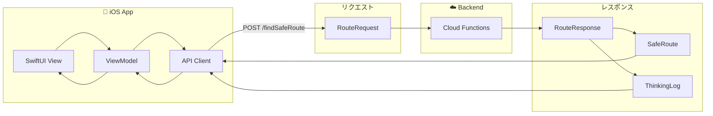

# データフロー

```mermaid
flowchart LR
    subgraph Client [📱 iOS App]
        UI[SwiftUI View]
        VM[ViewModel]
        API[API Client]
    end

    subgraph Request [リクエスト]
        RQ[RouteRequest]
    end

    subgraph Response [レスポンス]
        RS[RouteResponse]
        SR[SafeRoute]
        TL[ThinkingLog]
    end

    subgraph Server [☁️ Backend]
        CF[Cloud Functions]
    end

    UI --> VM --> API
    API -->|POST /findSafeRoute| RQ
    RQ --> CF
    CF --> RS
    RS --> SR
    RS --> TL
    SR --> API
    TL --> API
    API --> VM --> UI
```
