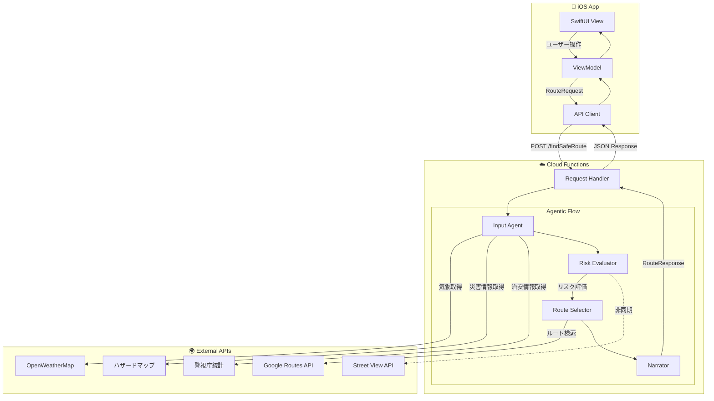
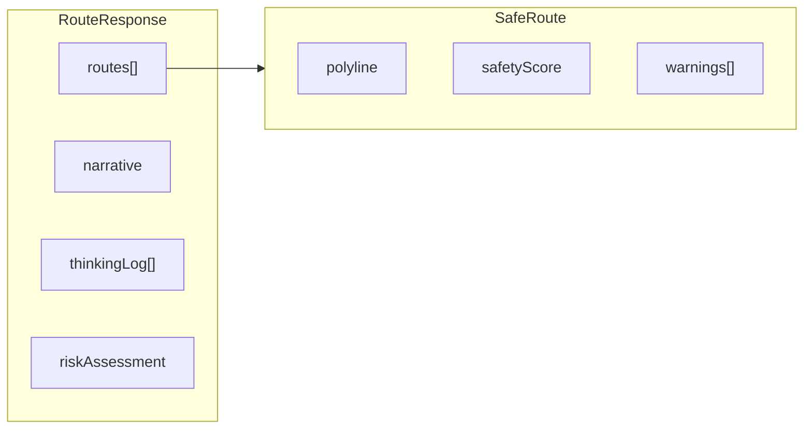

# データフロー

## 全体フロー

```mermaid
flowchart TB
    subgraph Client["📱 iOS App"]
        UI["SwiftUI View"]
        VM["ViewModel"]
        APIClient["API Client"]
    end

    subgraph Backend["☁️ Cloud Functions"]
        Handler["Request Handler"]
        
        subgraph Agents["Agentic Flow"]
            Input["Input Agent"]
            Risk["Risk Evaluator"]
            Route["Route Selector"]
            Narr["Narrator"]
        end
    end

    subgraph ExternalAPIs["🌍 External APIs"]
        Weather["OpenWeatherMap"]
        Hazard["ハザードマップ"]
        Police["警視庁統計"]
        Routes["Google Routes API"]
        SV["Street View API"]
    end

    UI -->|"ユーザー操作"| VM
    VM -->|"RouteRequest"| APIClient
    APIClient -->|"POST /findSafeRoute"| Handler
    
    Handler --> Input
    Input -->|"気象取得"| Weather
    Input -->|"災害情報取得"| Hazard
    Input -->|"治安情報取得"| Police
    
    Input --> Risk
    Risk -->|"リスク評価"| Route
    Route -->|"ルート検索"| Routes
    Route --> Narr
    
    Narr -->|"RouteResponse"| Handler
    Handler -->|"JSON Response"| APIClient
    APIClient --> VM --> UI
    
    Risk -.->|"非同期"| SV
```

## レスポンス構造

```mermaid
flowchart LR
    subgraph Response["RouteResponse"]
        R["routes[]"]
        N["narrative"]
        L["thinkingLog[]"]
        RA["riskAssessment"]
    end
    
    subgraph Route["SafeRoute"]
        P["polyline"]
        S["safetyScore"]
        W["warnings[]"]
    end
    
    R --> Route
```
