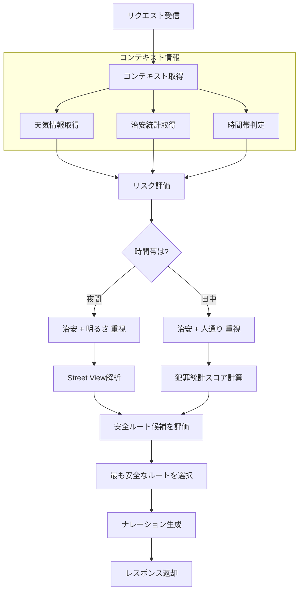

# 通常モード処理フロー

**コンセプト**: 日中・夜間問わず「安全なルート」を優先する

```mermaid
flowchart TD
    A["リクエスト受信"] --> B["コンテキスト取得"]
    
    subgraph Context["コンテキスト情報"]
        B --> C1["天気情報取得"]
        B --> C2["治安統計取得"]
        B --> C3["時間帯判定"]
    end
    
    C1 --> D["リスク評価"]
    C2 --> D
    C3 --> D
    
    D --> E{"時間帯は?"}
    
    E -->|"夜間"| F["治安 + 明るさ 重視"]
    E -->|"日中"| G["治安 + 人通り 重視"]
    
    F --> H["Street View解析"]
    G --> I["犯罪統計スコア計算"]
    
    H --> J["安全ルート候補を評価"]
    I --> J
    
    J --> K["最も安全なルートを選択"]
    K --> L["ナレーション生成"]
    L --> M["レスポンス返却"]
```

## ポイント
- **日中でも安全優先**: 最短ルートではなく、治安・人通りを考慮した安全ルートを提示
- **夜間は追加考慮**: 街灯の有無（Street View解析）も加味
