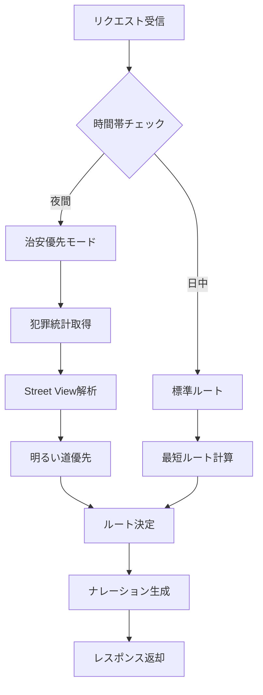

# 通常モード処理フロー

```mermaid
flowchart TD
    A[リクエスト受信] --> B{時間帯チェック}
    B -->|夜間| C[治安優先モード]
    B -->|日中| D[標準ルート]
    C --> E[犯罪統計取得]
    E --> F[Street View解析]
    F --> G[明るい道優先]
    D --> H[最短ルート計算]
    G --> I[ルート決定]
    H --> I
    I --> J[ナレーション生成]
    J --> K[レスポンス返却]
```
