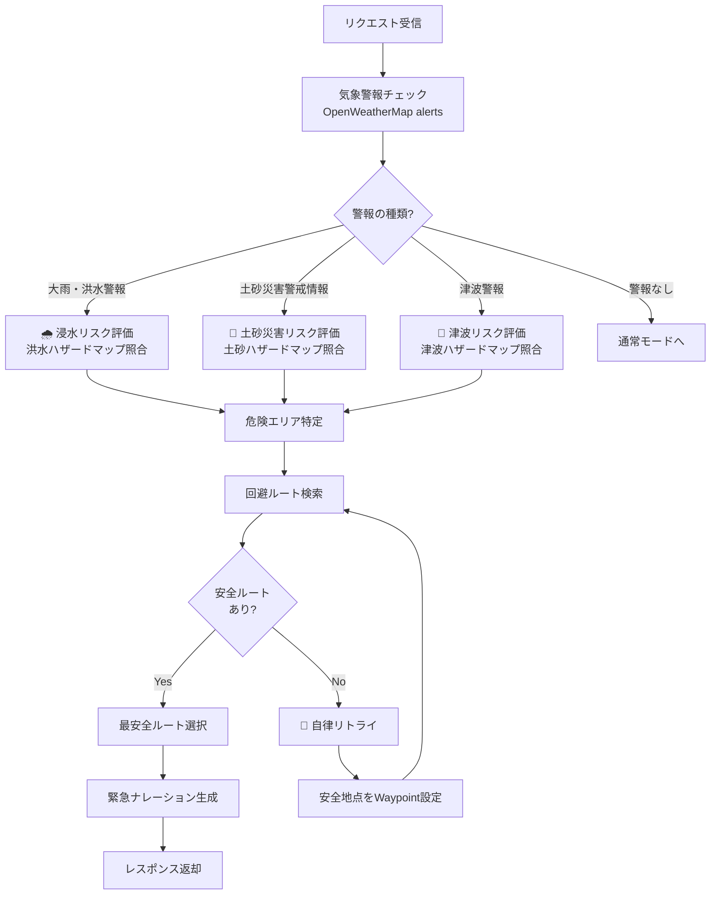

# 非常時モード処理フロー

**コンセプト**: 気象警報の種類に応じて、該当リスクのみを評価

## 警報とリスクの対応表
| 警報種別 | チェックするリスク | データソース |
| :--- | :--- | :--- |
| 大雨警報・洪水警報 | 浸水（洪水） | 洪水浸水想定区域 |
| 土砂災害警戒情報 | 土砂災害 | 土砂災害警戒区域 |
| 津波警報・大津波警報 | 津波 | 津波浸水想定区域 |

## ポイント
- **無駄なAPI呼び出しを削減**: 関連するリスクのみを評価
- **レスポンス速度向上**: 不要なハザードマップ照合をスキップ
