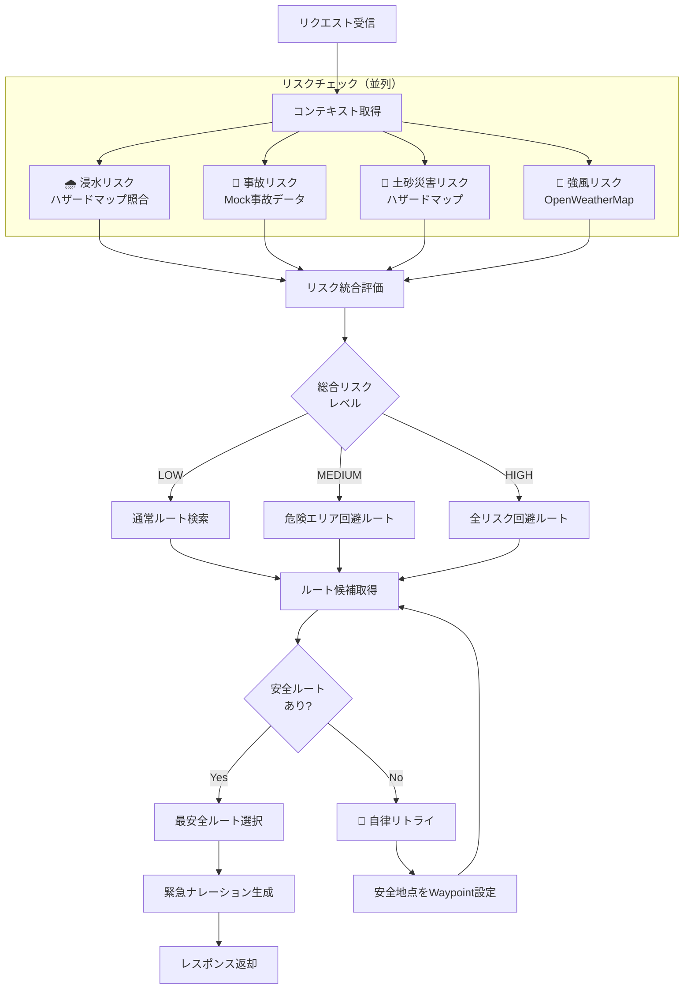

# 非常時モード処理フロー

**コンセプト**: 複数のリスク（浸水・事故・土砂・強風）を総合評価し、生存最優先ルートを提示

## 評価対象リスク
| リスク | データソース | 重み付け |
| :--- | :--- | :--- |
| 浸水 | ハザードマップ | 高 |
| 事故 | Mockデータ | 中 |
| 土砂災害 | ハザードマップ | 高 |
| 強風 | OpenWeatherMap | 低〜中 |
