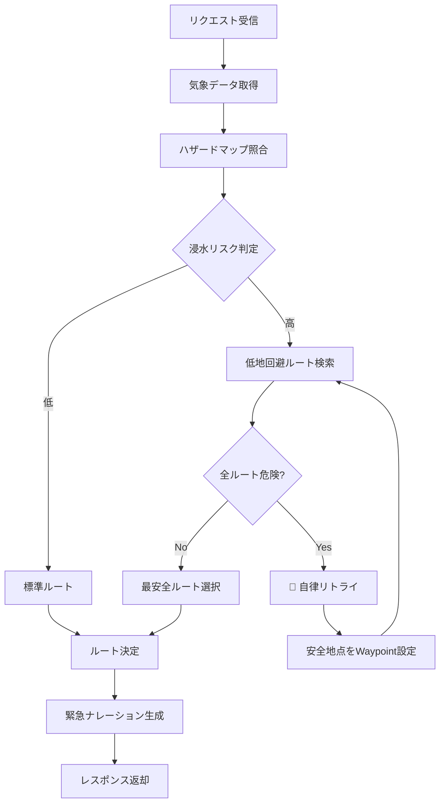

# 非常時モード処理フロー

```mermaid
flowchart TD
    A[リクエスト受信] --> B[気象データ取得]
    B --> C[ハザードマップ照合]
    C --> D{浸水リスク判定}
    D -->|低| E[標準ルート]
    D -->|高| F[低地回避ルート検索]
    F --> G{全ルート危険?}
    G -->|No| H[最安全ルート選択]
    G -->|Yes| I[🔄 自律リトライ]
    I --> J[安全地点をWaypoint設定]
    J --> F
    E --> K[ルート決定]
    H --> K
    K --> L[緊急ナレーション生成]
    L --> M[レスポンス返却]
```
