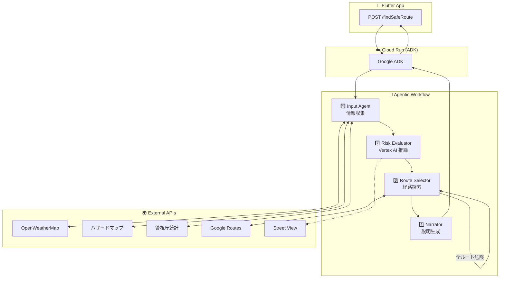

# Agentic Workflow 全体図

```mermaid
flowchart TB
    subgraph Client ["📱 Flutter App"]
        REQ["POST /findSafeRoute"]
    end

    subgraph Backend ["☁️ Cloud Run (ADK)"]
        ADK["Google ADK"]
    end

    subgraph Agents ["🤖 Agentic Workflow"]
        direction TB
        A1["1️⃣ Input Agent<br/>情報収集"]
        A2["2️⃣ Risk Evaluator<br/>Vertex AI 推論"]
        A3["3️⃣ Route Selector<br/>経路探索"]
        A4["4️⃣ Narrator<br/>説明生成"]
        
        A1 --> A2
        A2 --> A3
        A3 -->|全ルート危険| A3
        A3 --> A4
    end

    subgraph APIs ["🌍 External APIs"]
        W["OpenWeatherMap"]
        H["ハザードマップ"]
        P["警視庁統計"]
        R["Google Routes"]
        S["Street View"]
    end

    REQ --> ADK --> A1
    A1 <--> W
    A1 <--> H
    A1 <--> P
    A3 <--> R
    A2 -.-> S
    A4 --> ADK --> REQ
```
