# Agent別詳細図

## Input Agent
```mermaid
flowchart LR
    subgraph 並列取得
        W[OpenWeatherMap] --> |rain, wind| CTX
        H[ハザードマップ] --> |flood_depth| CTX
        P[警視庁統計] --> |crime_rate| CTX
        M[Mock事故データ] --> |accidents| CTX
    end
    CTX[Context Object] --> A2[Risk Evaluator]
```

## Risk Evaluator

```mermaid
flowchart TD
    CTX[Context + Mode] --> G3[Gemini 3]
    G3 --> |JSON Output| RS{Risk Score}
    RS -->|0-30| LOW[LOW リスク]
    RS -->|31-70| MED[MEDIUM リスク]
    RS -->|71-100| HIGH[HIGH リスク]
    
    LOW --> TAGS[Avoidance Tags 生成]
    MED --> TAGS
    HIGH --> TAGS
    TAGS --> A3[Route Selector へ]
```


## Route Selector (自律リトライ)

```mermaid
flowchart TD
    A[Routes API コール] --> B[代替ルート3-5本取得]
    B --> C{各ルートを<br/>ハザードと交差判定}
    C --> D{安全ルート<br/>あり?}
    D -->|Yes| E[最安全ルート選択]
    D -->|No| F[🔄 Agentic Loop]
    
    subgraph F [自律リトライ]
        F1[安全エリアの重心計算]
        F2[Waypoint として設定]
        F3[再度 Routes API コール]
        F1 --> F2 --> F3
    end
    
    F3 --> C
    E --> G[Agent 4 へ]
```


## Narrator

```mermaid
flowchart LR
    subgraph Input
        R[最終ルート]
        RA[リスク評価]
        M[ユーザーモード]
    end
    
    Input --> P{Persona選択}
    P -->|Normal| C[Concierge<br/>丁寧・安心]
    P -->|Emergency| T[Tactical<br/>命令形・短潔]
    
    C --> G3[Gemini 3]
    T --> G3
    G3 --> N[ナレーション生成]
```

