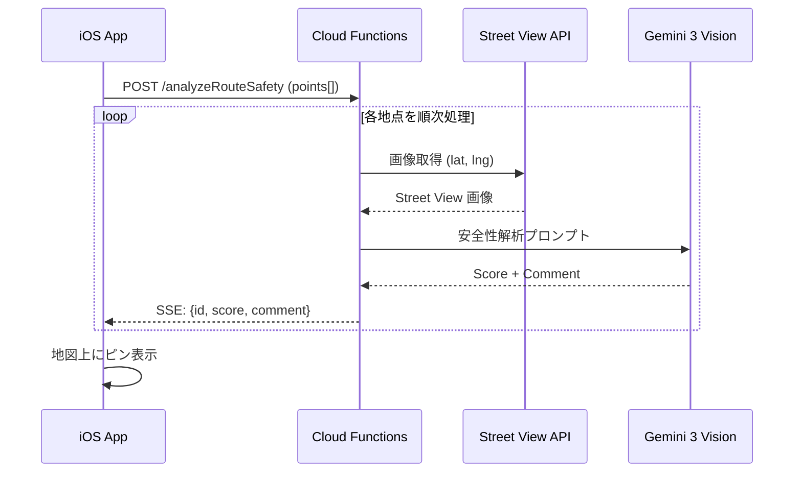

# 非同期安全スキャン シーケンス

```mermaid
sequenceDiagram
    participant iOS as iOS App
    participant CF as Cloud Functions
    participant SV as Street View API
    participant G3 as Gemini 3 Vision

    iOS->>CF: POST /analyzeRouteSafety (points[])
    loop 各地点を順次処理
        CF->>SV: 画像取得 (lat, lng)
        SV-->>CF: Street View 画像
        CF->>G3: 安全性解析プロンプト
        G3-->>CF: Score + Comment
        CF-->>iOS: SSE: {id, score, comment}
    end
    iOS->>iOS: 地図上にピン表示
```
