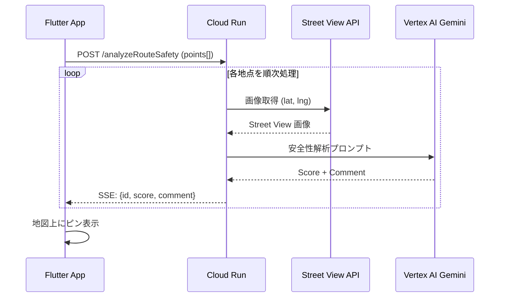

# 非同期安全スキャン シーケンス

```mermaid
sequenceDiagram
    participant App as Flutter App
    participant CR as Cloud Run
    participant SV as Street View API
    participant G3 as Vertex AI Gemini

    App->>CR: POST /analyzeRouteSafety (points[])
    loop 各地点を順次処理
        CR->>SV: 画像取得 (lat, lng)
        SV-->>CR: Street View 画像
        CR->>G3: 安全性解析プロンプト
        G3-->>CR: Score + Comment
        CR-->>App: SSE: {id, score, comment}
    end
    App->>App: 地図上にピン表示
```
