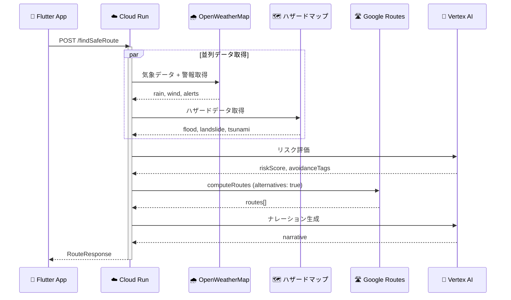

# API呼び出しシーケンス

```mermaid
sequenceDiagram
    participant App as 📱 Flutter App
    participant CR as ☁️ Cloud Run
    participant W as 🌧️ OpenWeatherMap
    participant H as 🗺️ ハザードマップ
    participant R as 🛣️ Google Routes
    participant G3 as 🤖 Vertex AI

    App->>CR: POST /findSafeRoute
    activate CR
    
    par 並列データ取得
        CR->>W: 気象データ + 警報取得
        W-->>CR: rain, wind, alerts
        CR->>H: ハザードデータ取得
        H-->>CR: flood, landslide, tsunami
    end
    
    CR->>G3: リスク評価
    G3-->>CR: riskScore, avoidanceTags
    
    CR->>R: computeRoutes (alternatives: true)
    R-->>CR: routes[]
    
    CR->>G3: ナレーション生成
    G3-->>CR: narrative
    
    CR-->>App: RouteResponse
    deactivate CR
```
