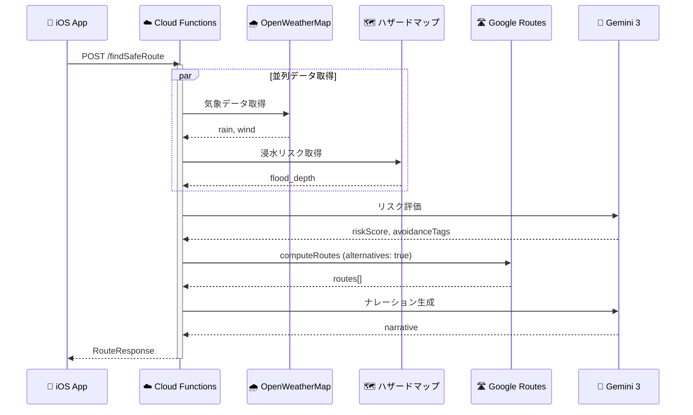

# API呼び出しシーケンス

```mermaid
sequenceDiagram
    participant iOS as 📱 iOS App
    participant CF as ☁️ Cloud Functions
    participant W as 🌧️ OpenWeatherMap
    participant H as 🗺️ ハザードマップ
    participant R as 🛣️ Google Routes
    participant G3 as 🤖 Gemini 3

    iOS->>CF: POST /findSafeRoute
    activate CF
    
    par 並列データ取得
        CF->>W: 気象データ取得
        W-->>CF: rain, wind
        CF->>H: 浸水リスク取得
        H-->>CF: flood_depth
    end
    
    CF->>G3: リスク評価
    G3-->>CF: riskScore, avoidanceTags
    
    CF->>R: computeRoutes (alternatives: true)
    R-->>CF: routes[]
    
    CF->>G3: ナレーション生成
    G3-->>CF: narrative
    
    CF-->>iOS: RouteResponse
    deactivate CF
```
