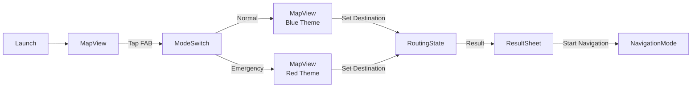

# 画面遷移図

```mermaid
flowchart LR
    Launch --> MapView
    MapView -->|Tap FAB| ModeSwitch
    ModeSwitch -->|Normal| MapView_Blue[MapView<br/>Blue Theme]
    ModeSwitch -->|Emergency| MapView_Red[MapView<br/>Red Theme]
    MapView_Blue -->|Set Destination| RoutingState
    MapView_Red -->|Set Destination| RoutingState
    RoutingState -->|Result| ResultSheet
    ResultSheet -->|Start Navigation| NavigationMode
```
