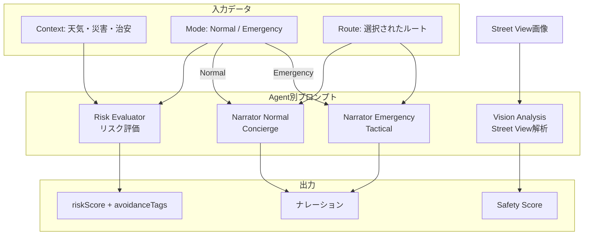

# プロンプトフロー

```mermaid
flowchart TB
    subgraph Input [入力データ]
        CTX[Context: 天気・災害・治安]
        MODE[Mode: Normal / Emergency]
        ROUTE[Route: 選択されたルート]
    end

    subgraph Agents [Agent別プロンプト]
        A2[Risk Evaluator<br/>リスク評価]
        A4N[Narrator Normal<br/>Concierge]
        A4E[Narrator Emergency<br/>Tactical]
        VIS[Vision Analysis<br/>Street View解析]
    end

    subgraph Output [出力]
        RISK[riskScore + avoidanceTags]
        NAR[ナレーション]
        SCORE[Safety Score]
    end

    CTX --> A2
    MODE --> A2
    A2 --> RISK

    ROUTE --> A4N
    ROUTE --> A4E
    MODE -->|Normal| A4N
    MODE -->|Emergency| A4E
    A4N --> NAR
    A4E --> NAR

    IMG[Street View画像] --> VIS
    VIS --> SCORE
```
