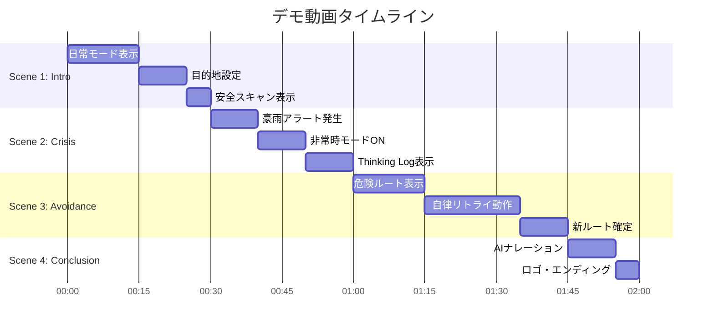

# デモ動画タイムライン

```mermaid
gantt
    title デモ動画タイムライン
    dateFormat mm:ss
    axisFormat %M:%S
    
    section Scene 1: Intro
    日常モード表示        :a1, 00:00, 15s
    目的地設定           :a2, after a1, 10s
    安全スキャン表示      :a3, after a2, 5s
    
    section Scene 2: Crisis
    豪雨アラート発生      :b1, 00:30, 10s
    非常時モードON       :b2, after b1, 10s
    Thinking Log表示     :b3, after b2, 10s
    
    section Scene 3: Avoidance
    危険ルート表示        :c1, 01:00, 15s
    自律リトライ動作      :c2, after c1, 20s
    新ルート確定         :c3, after c2, 10s
    
    section Scene 4: Conclusion
    AIナレーション       :d1, 01:45, 10s
    ロゴ・エンディング    :d2, after d1, 5s
```
