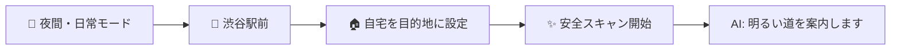
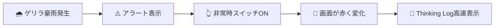
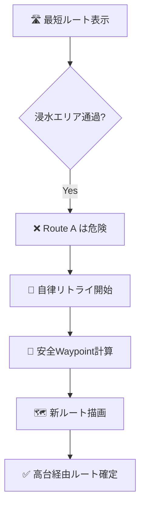
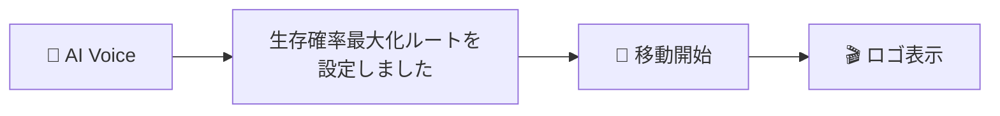

# デモシーン別フロー

## Scene 1: Intro

```mermaid
flowchart LR
    A[🌙 夜間・日常モード] --> B[📍 渋谷駅前]
    B --> C[🏠 自宅を目的地に設定]
    C --> D[✨ 安全スキャン開始]
    D --> E[AI: 明るい道を案内します]
```

## Scene 2: Crisis

```mermaid
flowchart LR
    A[🌧️ ゲリラ豪雨発生] --> B[⚠️ アラート表示]
    B --> C[👆 非常時スイッチON]
    C --> D[🔴 画面が赤く変化]
    D --> E[📜 Thinking Log高速表示]
```

## Scene 3: Avoidance

```mermaid
flowchart TD
    A[🛣️ 最短ルート表示] --> B{浸水エリア通過?}
    B -->|Yes| C[❌ Route A は危険]
    C --> D[🔄 自律リトライ開始]
    D --> E[📍 安全Waypoint計算]
    E --> F[🗺️ 新ルート描画]
    F --> G[✅ 高台経由ルート確定]
```

## Scene 4: Conclusion

```mermaid
flowchart LR
    A[🤖 AI Voice] --> B["生存確率最大化ルートを<br/>設定しました"]
    B --> C[🚶 移動開始]
    C --> D[🎬 ロゴ表示]
```
