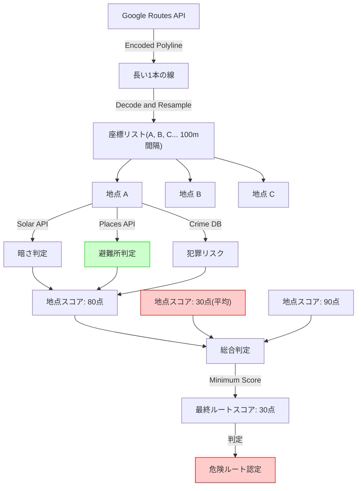

# リスク評価ロジック (Route Sampling & Bottle-neck Logic)

```mermaid
graph TD
    %% Step 1
    API["Google Routes API"] -->|Encoded Polyline| LINE["長い1本の線"]

    %% Step 2
    LINE -->|Decode and Resample| POINTS["座標リスト(A, B, C... 100m間隔)"]

    %% Step 3
    POINTS --> SCAN_A["地点 A"]
    POINTS --> SCAN_B["地点 B"]
    POINTS --> SCAN_C["地点 C"]

    %% Scan Details
    SCAN_A -->|Solar API| SOLAR["暗さ判定"]
    SCAN_A -->|Places API| SAFE["避難所判定"]
    SCAN_A -->|Crime DB| CRIME["犯罪リスク"]
    
    SOLAR --> SCORE_A["地点スコア: 80点"]
    SAFE --> SCORE_A
    CRIME --> SCORE_A

    %% Step 4
    SCORE_A --> AGG["総合判定"]
    SCORE_B["地点スコア: 30点(平均)"] --> AGG
    SCORE_C["地点スコア: 90点"] --> AGG
    
    AGG -->|Minimum Score| FINAL["最終ルートスコア: 30点"]
    FINAL -->|判定| DANGER["危険ルート認定"]

    %% Styling
    style DANGER fill:#ffcccc,stroke:#ff0000
    style SCORE_B fill:#ffcccc,stroke:#ff0000
    style SAFE fill:#ccffcc,stroke:#00ff00
```
