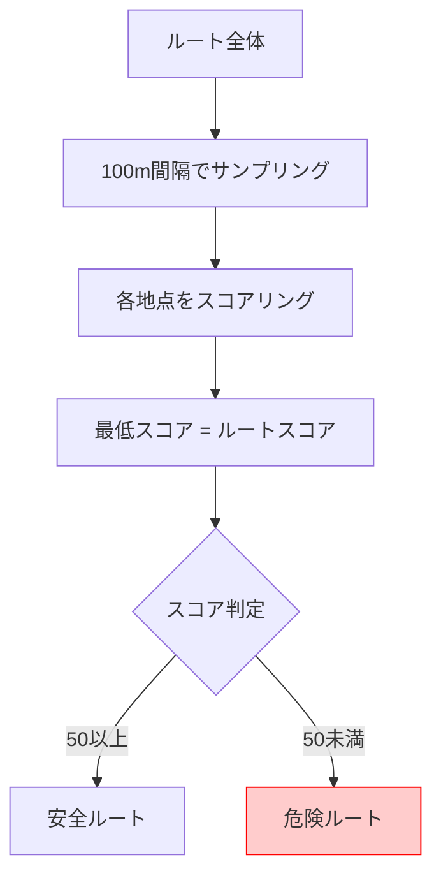

# リスク評価ロジック (Mode-based Evaluation)

## 評価項目一覧

| 項目 | 通常モード | 緊急モード | データソース |
|------|:----------:|:----------:|--------------|
| 視覚的雰囲気 | ✅ | ❌ | Street View + Gemini Vision |
| 日陰リスク | ✅ | ❌ | Solar API |
| 安全スポット | ✅ | ❌ | Places API |
| 浸水ハザード | ❌ | ✅(警報時) | 国土交通省タイル |
| 津波ハザード | ❌ | ✅(警報時) | 国土交通省タイル |
| 土砂災害ハザード | ❌ | ✅(警報時) | 国土交通省タイル |

> [!NOTE]
> **標高/浸水リスク**は削除。ハザードマップの方が信頼性が高いため。

---

## ボトルネック評価

---

## 警報とハザードのマッピング

| 警報タイプ | ハザードサービス |
|------------|------------------|
| 大雨警報・洪水警報 | 浸水ハザードマップ |
| 津波警報・津波注意報 | 津波ハザードマップ |
| 土砂災害警戒情報 | 土砂災害ハザードマップ |
