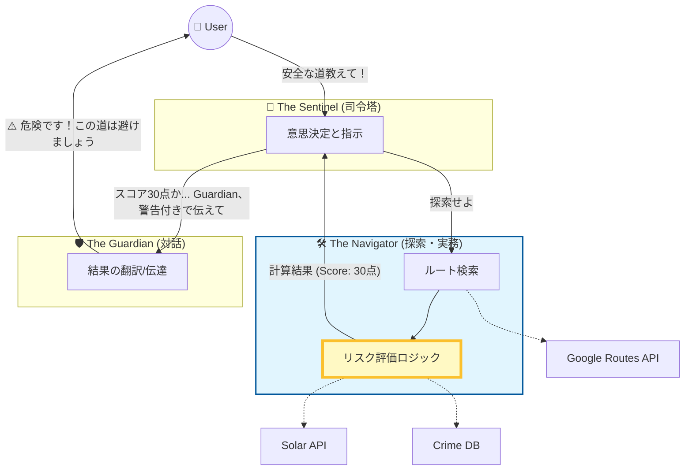

# 全体フローにおける Navigator の位置づけ

`The Navigator` は、司令塔 (`Sentinel`) からの実務命令を受けて、具体的な計算と調査を行う「実行部隊」です。

## 今やっていること
この図の **黄色い枠 (`リスク評価ロジック`)** の中身を実装しようとしています。
ここが出来上がらないと、Sentinelは判断材料（スコア）を得られず、Guardianも何も言えません。
